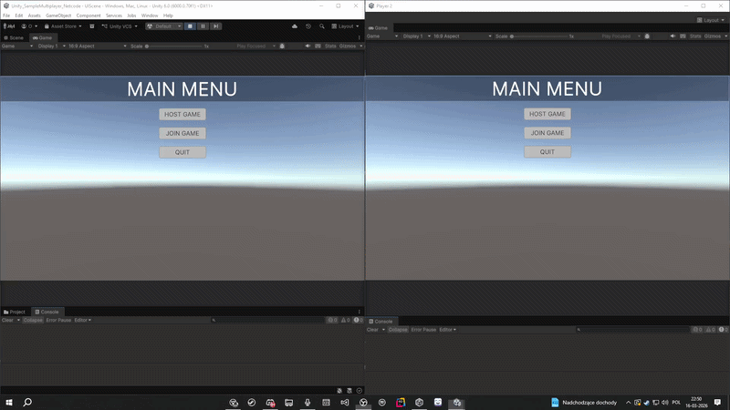
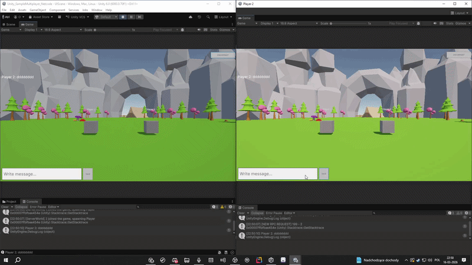
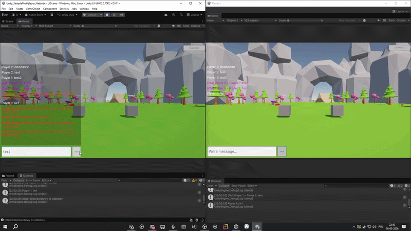

# SampleMultiplayer

A simple multiplayer game built in Unity using **Netcode for Entities**.  

## Demo
Host/Join Game

Chat

Disconnect

### [Download v0.1.0](https://github.com/owerrr/Unity_SampleMultiplayer_Netcode/releases/tag/v0.1.0)

 

## Controls

| Key | Action |
|---|---|
| `W` | Move forward |
| `S` | Move backward |
| `A` | Move left |
| `D` | Move right |
 
## Features

- **Multiplayer movement** - up to 4 players, move your cube with WASD.
- **Chat system** - send public messages or whisper privately with `/w <ID> <message>`.
- **Player nameplates** - each player has a name displayed above their cube.
- **Host & Join** - one player hosts, others join via localhost.
 
## Notes

- Game runs on **localhost** (`127.0.0.1:7979`), intended for local testing
- If the host disconnects, clients are automatically returned to the main menu
- If joining fails (no server found), the client returns to menu after a **3 second timeout**